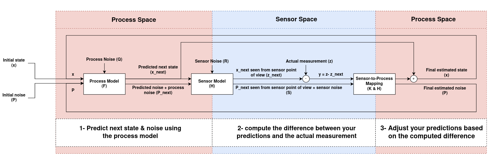

# Localization: Kalman Filters

**A Kalman Filter is a model-based estimation algorithm. Why model-based? Because it uses a model of the system and using that model takes in noisy observations from which it estimates the current state” of the system**

**Idea:** Kalman filtering is an algorithm that provides estimates of some unknown variables given the measurements observed over time

Kalman filters iterate over:

- Measurement updates
  - Uses Bayes Rule / Product to calculate
- Predictions
  - Uses Total probability (addition) / convolution to calculate

Just like Histogram Filters (Localization), it tries to form an approximately correct posterior distribution using measurement
and motion updates. Kalman filters try to estimate the gaussian distribution which is our best estimate of the location of the object

Variables of a Kalman filter are often called "States" because they reflect states of the physical world, like where an object is and how fast it is moving

- There are two sets of KF variables:
  - **Observables:** momentary location
  - **Hidden:** We infer it from our location measurements

 

# How it works

The GPS sensor tells us something about the state, but only indirectly, and with some uncertainty or inaccuracy. Our prediction
tells us something about how the robot is moving, but only indirectly, and with some uncertainty or inaccuracy. By using both
the sensor readings and the predictions from our model, we can get a better estimate than using either one of the sources only

 

# Comparison to Histogram Filters

- **States:**

  - Kalman filters estimate a continuous state
  - Histogram Filters estimate a discrete state

- **Probability Distribution:**
  - Kalman Filter: uni-modal
  - Histogram Filters: Multi-modal
- Both methods are useful for tracking vehicles and

# Kalman Filter Process Flow

# What do we need?

1. State Transition Function

- $\begin{aligned} \begin{bmatrix} x' \\ \dot x \\ \end{bmatrix} \leftarrow \begin{bmatrix} 1 & 1 \\ 0 & 1 \\ \end{bmatrix} \begin{bmatrix} x \\ \dot x \\ \end{bmatrix} \end{aligned}$ == F Matrix

  - New X position: $x' = x + \dot x$
  - X Velocity (Assume velocity is constant): $\dot x = \dot x$

2. Measurement Function

- $\begin{aligned} Z \leftarrow \begin{bmatrix} 1 & 0 \\ \end{bmatrix} \begin{bmatrix} x \\ \dot x \\ \end{bmatrix} \end{aligned}$ == H Matrix

  - For the measurement function, we only observe the next place of X, not the velocity

 

# Kalman Filter Design:

1. Prediction Step

   1. $x' = Fx + u$

      - Multiply state transition matrix with x (estimate) and add u (motion vector)

   2. $P' = F * P * F^T$

      - Where P == the uncertainty covariance matrix

2. Measurement Step

   1. $y (error) = z - H*x$

      - Compare the measurement with our prediction

   2. $S = H * P * H^T + R$
   3. $Kalman \space Gain = P * H^T * S^{-1}$
   4. $x' = x + (K * y)$

      - Finally we update our estimate

   5. $P = (I - K *H) * P$

# Components:

- Vector X: **State Variables**

  - x are the values of all the variables you're considering in your system

 

- Matrix F: **The Update Matrix (State Transition Matrix)**

  - F is the **n by n** update matrix. Kalman filters model a system over time. After each tick of time, we predict what the values of x are, and then we measure and do some computation
  - F is used in the update step. Here's how it works: For each value in x, we write an equation to update that value, a linear equation in all the variables in x. Then we can just read off the coefficients to make the matrix

 

- Matrix Z: **Measurement Matrix**

  - Outputs from the sensors
  - Let's say we have m sensors. That could be, and probably is, different from n, the number of variables we're keeping track of. In our example, let's say we have three temperature probes, all somewhat inaccurate

 

- Matrix H: **Extraction Matrix (Measurement Function)**
  - The matrix H tells us what sensor readings we'd get if x were the true state of affairs and our sensors were perfect. It's the matrix we use to extract the measurement from the data. If we multiply H times a perfectly correct x, we get a perfectly correct z
  - **Only tracks the observable variables**

 

- Matrix P: **Covariance Matrix**
  - P is the covariance matrix of the vector x. **x is a vector of dimension n, so P is n by n**
    - Down the diagonal of P, we find the variances of the elements of x: the bigger the number, the bigger our window of uncertainty for that element
  - On the off diagonals, at P[i][j], we find the covariances of x[i] with x[j]
    - Covariance matrices must be symmetric matrices, because the covariance of x[i] and x[j] is also the covariance of x[j] and x[i], so P[i][j]==P[j][i]. That is, the whole thing is symmetric with the main diagonal as the mirror line
  - P gets updated as we run our Kalman filter and become more certain of the value of the x vector.

 

- Matrix R: **Covariance matrix of the measurement vector z**
  - R is also a covariance matrix, but it's the variances and covariances of our sensor measurements
    - Because z has dimension m, R is an m by m matrix
  - **The Kalman filter algorithm does not change R, because the process can't change our belief about the accuracy of our sensors. That's a property of the sensors themselves**

 

- Matrix U: **Motion Vector**
  - The last input matrix is the vector u. This one is pretty simple; it's the control input, the move vector. It's the change to x that we cause, or that we know is happening
    - Since we add it to x, it has dimension n

 

# KF Process Flow

3 Main Calculations are being performed in a KF:

1. Calculate Kalman Gain
   - What do we need to calculate this?
     - Error in the estimate (previous error)

 

2. Calculate the Current Estimate
   - What do we need?
     - Previous estimate
     - Measured Value (data input)
       - If first time through, we take the original estimate

 

3. Calculate the error in the new estimate
   - What do we ned to calculate?
     - Kalman Gain
     - Current Estimate

# References

- https://www.bzarg.com/p/how-a-kalman-filter-works-in-pictures/
