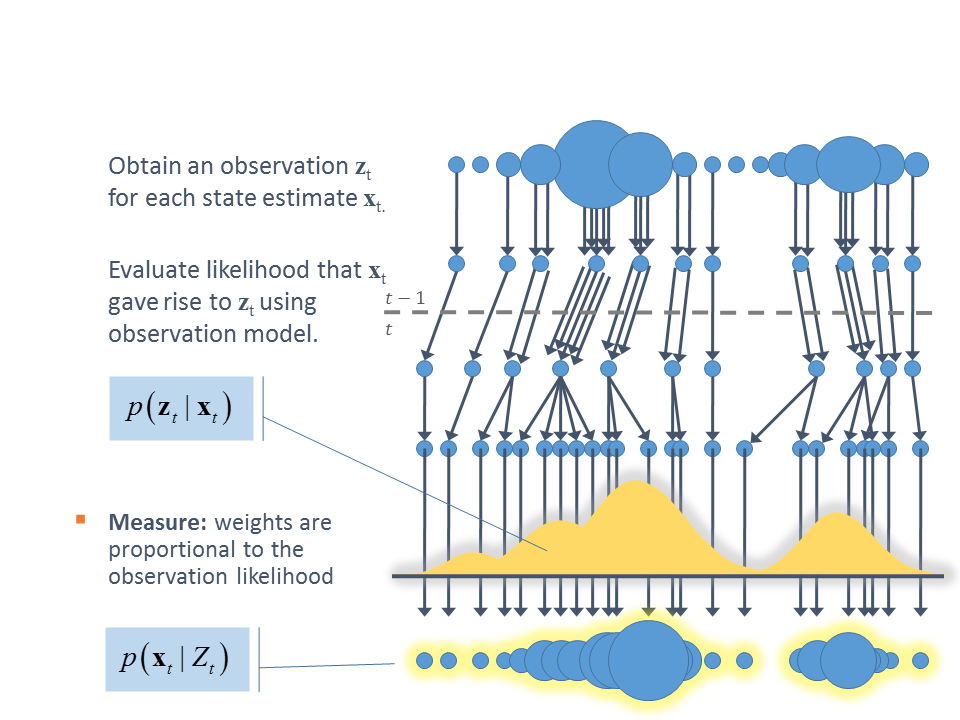
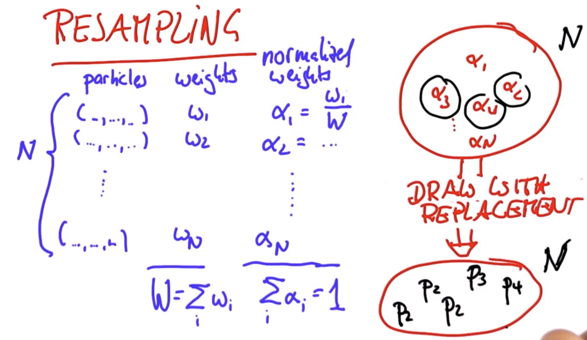

# Localization: Particle Filters (Monte Carlo Localization)

# What is it?

The core idea of ​​the particle filter is based on Monte Carlo methods, which uses particle sets to
represent probabilities and can be used in any form of state space model. The core idea is to express its distribution
by extracting random state particles from the posterior probability. It is a sequential importance sampling method
(Sequential Importance Sampling)

 

# How it works

Have the particles guess where the robot might be moving but also have them survive so that particles that are more
consistent with the measurement are more likely to survive - Places of higher probability will collect more particles
and therefore be more representative of the posterior distribution

- The goal is to have the particles survive in proportion of how consistent a particle is with the sensor measurement
- Each particle has an importance weight
- The probability of survival is proportional to their

 
 

# Particle Filter Steps

1. Measurement Updates
   - Compute the posterior over the state given a measurement that's proportional to the probability of the measurement
     given the state \* P(state)

 

2. Motion Updates
   - Compute a posterior one-time step later: convolution of the transition probability \* Prior

 

# Importance Weights

The mismatch between the actual measurement and the predicted measurement leads to an importance weight. This tells
us **how important that particle is**

 

### Resampling Wheel Steps

1. Pick a random position on the wheel
   - $index = U[1,....N]$
2. Find a weight value which can be as much as twice the maximum weight. This is called $\beta$
   - Initialize with 0
3. If the weight of position picked at step 1 is less than beta then pick that particle and add to the list of resampling
4. If not, subtract the value of the weight of the particle at step 1 from beta and move to the next particle. This will be the next particle in the pie. If this particle is also of less weight than beta, then pick it. Otherwise, continue to look for the next particle unless weight condition is met
5. Repeat step 2–4 n times, which is the size of resampling

- The probability of survival is proportional to the importance weights

 

# Characteristics

- Continuous state spaces
- Multimodal distributions
- Approximate solutions like Kalman and Histogram filters
- Uncertain efficiency
  - Some domains are exponential
- Key Advantage:
  - Easy to implement and program
  - Most flexible

# References

- https://towardsdatascience.com/particle-filter-a-hero-in-the-world-of-non-linearity-and-non-gaussian-6d8947f4a3dc
